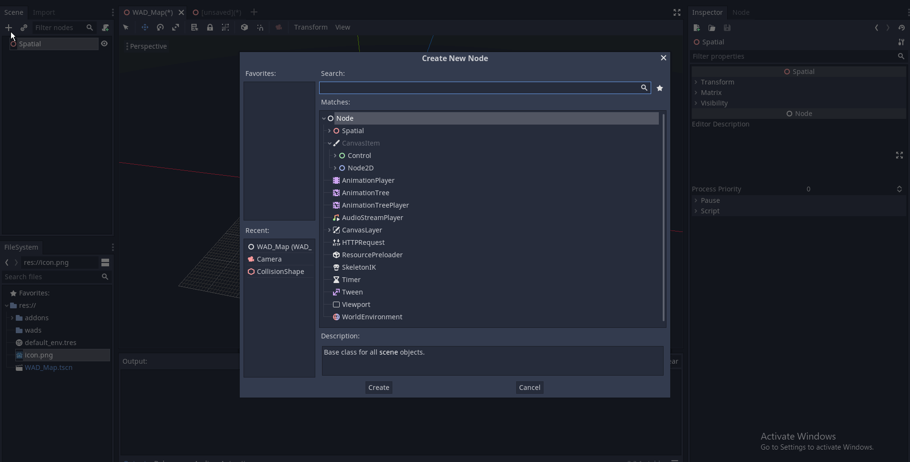
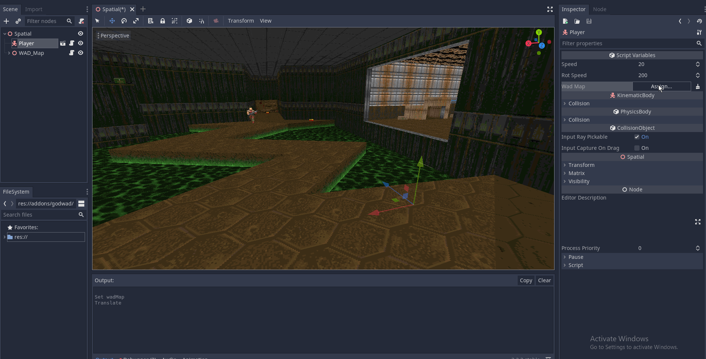
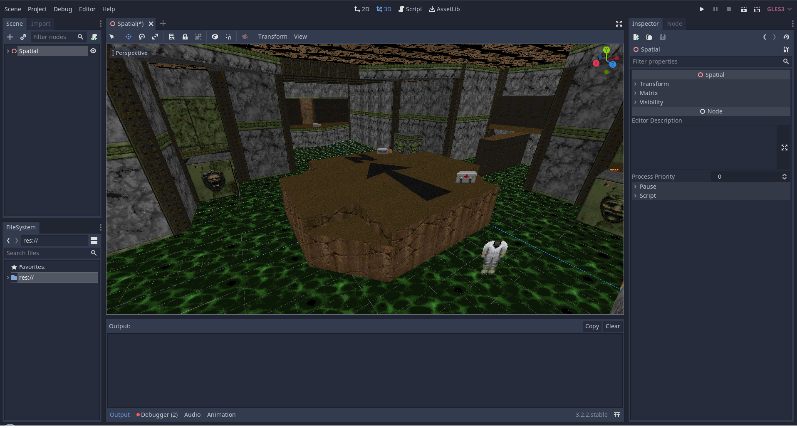

# GodWad
A doom WAD map importer plugin for Godot

## Installation
Copy the "addons" folder into the root directory of the Godot Project

Go to Project->Project Settings->Plugins and set the plugins status to "Active"

## Usage

## Player controller

For testing purposes there is a player controller Player.tscn  
Add the player to the tree and point its "Wad Map" parameter to the WAD_Map node.  

## Media 

